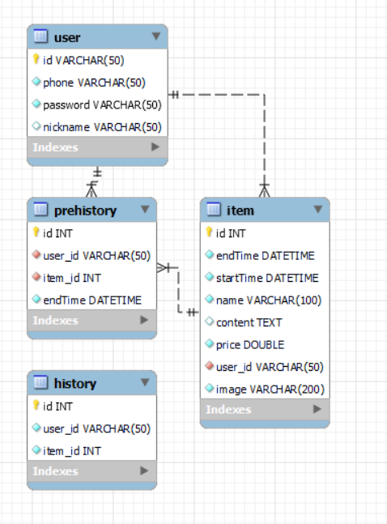
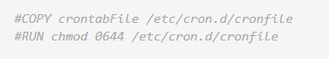
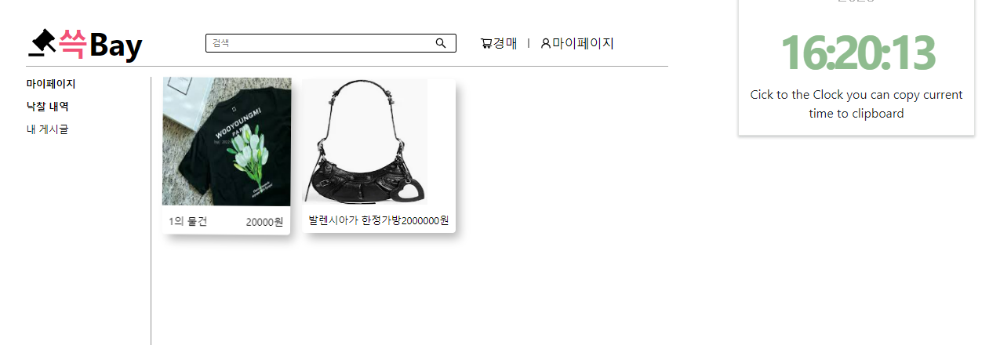
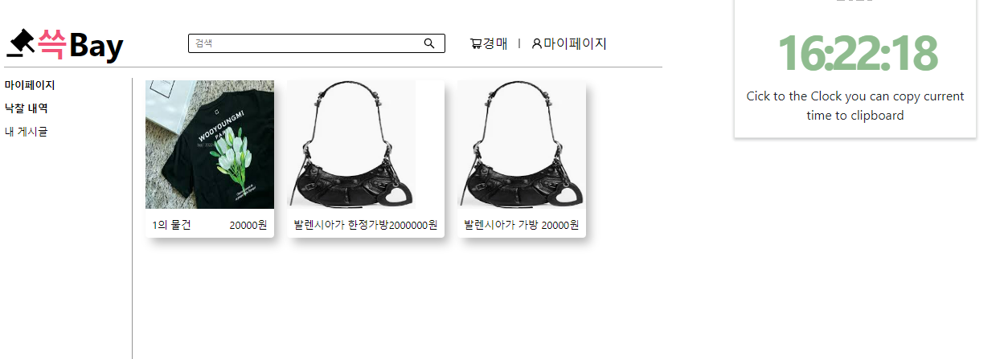
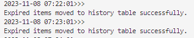
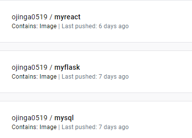

# AuctionProject

# 👖 미니 웹프로젝트2 - 중고 물품 경매 웹사이트👖

## 목차

- [개요 및 팀 소개](#개요)
- [진행 과정](#프로젝트-진행-과정)
- [구현 화면](#구현-페이지)

## 개요

- 프로젝트 이름: 중고 물품 경매 웹사이트
- 프로젝트 목적 :
  - 3계층 마이크로서비스 아키텍처(MSA) 배포
  - 1차 프로젝트때 주제가 명확하지 않아 변경
  - 한정판 같은 물건들을 경매사이트에 올림으로 소비자, 구매자 모두 만족 가능
- 프로젝트 기간: 2023.11.26 - 2013.11.02
- 개발 엔진 및 언어: Python Flask, React, MySQL, Docker, Kubernetes
- 멤버: 김상훈, 윤규희, 윤석현, 최인혁, 전경원

## 👨‍👨‍👦 팀소개

|                                                                                                                            김상훈                                                                                                                            |                                                                                                                                        윤규희                                                                                                                                        |                                                               윤석현                                                               |                                                            최인혁                                                            |                                                            전경원                                                            |
| :-----------------------------------------------------------------------------------------------------------------------------------------------------------------------------------------------------------------------------------------------------------: | :-----------------------------------------------------------------------------------------------------------------------------------------------------------------------------------------------------------------------------------------------------------------------------------: | :---------------------------------------------------------------------------------------------------------------------------------: | :---------------------------------------------------------------------------------------------------------------------------: | :---------------------------------------------------------------------------------------------------------------------------: |
|     |         |    |   |   |

### ⚙️ 기술 스택

#### FRONTEND


#### BACKEND


#### 자동 배포화 도구


## 프로젝트 진행 과정

|       일별       | 내용                                                                   |
| :--------------: | ---------------------------------------------------------------------- |
|  1일차 `<br>`  | - 주제 선정, 기술 스택 결정, 데이터 베이스 설계                        |
| 2~6일차 `<br>` | - CRUD 기능 개발                                                       |
|  7일차 `<br>`  | - 도커를 사용하여 이미지를 빌드하고, 쿠버네티스를 통해 클러스터에 배포 |
|  8일차 `<br>`  | - 프로젝트 보고서 작성 및 발표                                         |

## 프로젝트 구조 및 특징

### ER DIAGRAM



### BACKEND

- API명을 카멜 케이스로 정의하여 네이밍 컨벤션을 지키도록 하였습니다.

```
📦backend
 ┣ 📂node_modules
 ┃ ┣ 📂flask-cors
 ┃ ┃ ┗ 📜package.json
 ┃ ┗ 📜.package-lock.json
 ┣ 📂resources # 프론트엔드에서 사용자가 업로드한 이미지를 저장
 ┃ ┣ 📜image.jpeg
 ┃ ┣ 📜me.png
 ┃ ┣ 📜김상훈.JPEG
 ┃ ┣ 📜우영미.JPEG
 ┃ ┗ 📜캡처.JPG
 ┣ 📂__pycache__
 ┃ ┗ 📜database.cpython-312.pyc
 ┣ 📜app.py
 ┣ 📜database.py
 ┣ 📜Dockerfile-flask
 ┣ 📜Dockerfile-mysql
 ┣ 📜historyUpdate.py #주기적으로 낙찰내역을 업데이트하는 cron에 사용되는 파일
 ┣ 📜init.sql
 ┗ 📜requirements.txt
```

- `JWT`을 만들어서 로그인 정보 있을 시 `localStorage`에 저장 -
  - 이 방법은 보안 상 취약 -> Access Token을 유효 기간을 짧게 설정하고,  만료되면 Refresh Token을 발급받도록 하는 방식으로 개선 가능

```python
from flask_jwt_extended import JWTManager
from flask_jwt_extended import create_access_token
import os


app.config["JWT_SECRET_KEY"] = "super-secret"
app.config['UPLOAD_FOLDER'] = UPLOAD_FOLDER
jwt = JWTManager(app)

@app.route('/login', methods = ["GET", "POST"])
def login():
    if request.method == 'POST':
        userId = request.json.get('id')
        password = request.json.get('password')
   
        isid = database.idCheck(userId, password)
        if(isid) :
            access_token = create_access_token(identity=userId)
            return jsonify({'token': access_token, 'userId':userId}), 200
        else : 
            return jsonify({'message': '잘못된 로그인 정보입니다. 다시 입력해주세요.'}), 401

``` 
- 백그라운드에서 주기적으로 실행되는 자동화 작업
- 매분 매초에 crontab을 실행하며 경매 내역에 있는 데이터의 만료시간이 현재시간을 지났을 경우 history(낙찰 테이블)에 자동으로 넣는 python 파일 실행한다. 
-  :collision: 에러 해결 과정
    - crontab 파일을 따로 만들어서 도커파일에서 실행하게함 
    
    
    - frontend에서도 현재시간을 지났으면 낙찰 못하게 버튼 비활성화하게 개선 가능 
    - Kubernetes의 cronJob으로 개선하면 좋을듯 
``` docker
RUN crontab -l | { cat; echo "* * * * * /usr/local/bin/python /app/historyUpdate.py >> /var/log/cron.log 2>&1"; } | crontab -
```
- 경매 낙찰 후 만료 시간이 지나면 마이페이지 경매내역에 추가 되는 것을 볼 수 있다




- flask service로 접속하여 cronlog를 보면 1분마다 수행이 잘 되는 것을 볼 수 있다. 



- backend resource에 이미지 저장 
    - 설정 변수에 넣어놓은 절대 경로에 이미지 저장
    - 데이터베이스에 넣을 때는 해당 파일에 접근할 수 있는 URL을 생성 후 INSERT
    
``` python
file.save(os.path.join(app.config['UPLOAD_FOLDER'], file.filename))
image_url = 'http://10.0.0.9:5000/resources/' + file.filename

```
### FRONTEND

- 컴포넌트와 페이지를 분리함으로, 여러 페이지에서 사용는 카드, 헤더 등을 재사용할 수 있게 되었습니다.

```
📦src
 ┣ 📂components
 ┃ ┣ 📜Card.js
 ┃ ┣ 📜Card.module.css
 ┃ ┣ 📜CreatePage.module.css
 ┃ ┣ 📜DetailPage.module.css
 ┃ ┣ 📜Footer.js
 ┃ ┣ 📜Footer.module.css
 ┃ ┣ 📜Header.js
 ┃ ┣ 📜Header.module.css
 ┃ ┣ 📜LoginPage.module.css
 ┃ ┣ 📜MainPage.module.css
 ┃ ┗ 📜MyPage.module.css
 ┣ 📂pages
 ┃ ┣ 📜CreatePage.js
 ┃ ┣ 📜DetailPage.js
 ┃ ┣ 📜LoginPage.js
 ┃ ┣ 📜MainPage.js
 ┃ ┣ 📜MyPage.js
 ┃ ┗ 📜SignupPage.js
 ┣ 📜App.css
 ┣ 📜App.js
 ┣ 📜App.test.js
 ┣ 📜index.css
 ┣ 📜index.js
 ┣ 📜logo.svg
 ┣ 📜reportWebVitals.js
 ┗ 📜setupTests.js
```

- Axios를 사용하여 서버와의 HTTP 요청을 만들고 응답을 처리

```javascript
axios
      .put(`http://10.0.0.9:5000/detail/${id}`, { price: price })
      .then((response) => {
        setData({ ...data, price: price });
        console.log("가격이 업데이트되었습니다.");

        const datas = new FormData();
        datas.append('itemId', data.id);
        datas.append('userId', purchaseId);
        datas.append('endTime', data.endTime);
        console.log(data.id)
        console.log(purchaseId)

        return axios.post(`http://10.0.0.9:5000/history`, datas);
      })
      .catch((error) => {
        console.error(error);
      });
```
- async/await: async함수 내부에서 await로 서버와 통신하고 promise가 끝나면 
처리 결과에 따라 다른 결과 반환
- 비동기 함수를 사용하여 다른 작업을 병렬로 실행할 수 있어 시스템 성능 향상 가능 


```javascript

 const handlerLogin = async () => {
    try {
      const response = await fetch(`http://10.0.0.9:5000/login`, {
        method: 'POST',
        headers: {
          'Content-Type': 'application/json'
        },
        body: JSON.stringify({ id, password })
      });
      console.log(response)

      if (response.ok) {
        console.log('로그인 성공! 토큰:', token);
      } else {
        console.log('로그인 실패!');
      }
    } catch (error) {
      console.error('로그인 중 오류 발생:', error);
    }
};

```

앞서 만들었던 React, Flask, Mysql Database를 이용해 3계층 마이크로서비스 아키텍처(MSA) 배포하였습니다. 


# Docker Container
## Mysql Database 컨테이너화
### Database를 Mysql Workbench의 Forwarding tool을 통해 ER-DIAGRAM에서 DDL 추출
```sql
CREATE SCHEMA IF NOT EXISTS `auction` DEFAULT CHARACTER SET utf8mb4 COLLATE utf8mb4_0900_ai_ci ;
USE `auction` ;

-- -----------------------------------------------------
-- Table `auction`.`user`
-- -----------------------------------------------------
CREATE TABLE IF NOT EXISTS `auction`.`user` (
  `id` VARCHAR(50) NOT NULL,
  `phone` VARCHAR(50) NOT NULL,
  `password` VARCHAR(50) NOT NULL,
  `nickname` VARCHAR(50) NULL DEFAULT NULL,
  PRIMARY KEY (`id`))
ENGINE = InnoDB
DEFAULT CHARACTER SET = utf8mb4
COLLATE = utf8mb4_0900_ai_ci;
-- -----------------------------------------------------
-- Table `auction`.`history`
-- -----------------------------------------------------
CREATE TABLE IF NOT EXISTS `auction`.`history` (
  `id` int NOT NULL AUTO_INCREMENT,
  `user_id` varchar(50) NOT NULL,
  `item_id` int NOT NULL,
  PRIMARY KEY (`id`)
) ENGINE=InnoDB AUTO_INCREMENT=27 DEFAULT CHARSET=utf8mb4 COLLATE=utf8mb4_0900_ai_ci;
-- -----------------------------------------------------
-- Table `auction`.`item`
-- -----------------------------------------------------
CREATE TABLE IF NOT EXISTS `auction`.`item` (
  `id` INT NOT NULL AUTO_INCREMENT,
  `endTime` DATETIME NOT NULL,
  `startTime` DATETIME NOT NULL,
  `name` VARCHAR(100) NOT NULL,
  `content` TEXT NULL DEFAULT NULL,
  `price` DOUBLE NOT NULL,
  `user_id` VARCHAR(50) NOT NULL,
  `image` VARCHAR(200) NOT NULL,
  PRIMARY KEY (`id`),
  INDEX `fk_item_user_idx` (`user_id` ASC) VISIBLE,
  CONSTRAINT `fk_item_user`
    FOREIGN KEY (`user_id`)
    REFERENCES `auction`.`user` (`id`)
    ON DELETE CASCADE # 부모 레코드가 사라지면 자식 레코드도 연쇄적으로 삭제 -> 데이터 무결성
    ON UPDATE CASCADE)
ENGINE = InnoDB
AUTO_INCREMENT = 32
DEFAULT CHARACTER SET = utf8mb4
COLLATE = utf8mb4_0900_ai_ci;


-- -----------------------------------------------------
-- Table `auction`.`history`
-- -----------------------------------------------------
CREATE TABLE IF NOT EXISTS `auction`.`prehistory` (
  `id` int NOT NULL AUTO_INCREMENT,
  `user_id` varchar(50) NOT NULL,
  `item_id` int NOT NULL,
  `endTime` datetime NOT NULL,
  PRIMARY KEY (`id`),
  KEY `fk_prehistory_user1_idx` (`user_id`),
  KEY `fk_prehistory_item1_idx` (`item_id`),
  CONSTRAINT `fk_prehistory_item1` FOREIGN KEY (`item_id`) REFERENCES `item` (`id`),
  CONSTRAINT `fk_prehistory_user1` FOREIGN KEY (`user_id`) REFERENCES `user` (`id`)
)
ENGINE = InnoDB
AUTO_INCREMENT = 6
DEFAULT CHARACTER SET = utf8mb4
COLLATE = utf8mb4_0900_ai_ci;

CREATE USER 'user1'@'%' IDENTIFIED BY '1234';
GRANT ALL ON auction.* TO 'user1'@'%';
```
### Mysql Database Dockerfile 작성
C:\miniProjectFront\Dockerfile
``` DockerFile
FROM mysql:8.0
# ENV MYSQL_ROOT_USER=root
ENV MYSQL_ROOT_PASSWORD=1234
COPY ./init.sql /docker-entrypoint-initdb.d 
# 이 디렉토리 내의 SQL 파일은 컨테이너가 처음 시작될 때 자동으로 실행
```
### 작성한 Dockerfile로 mysql db 이미지 빌드

```shell
C:\Users\User\Desktop\miniProjectBack>docker image build -t mysql:1.0 -f Dockerfile-mysql .
# 한 디렉토리내에 도커파일이 여러개면 이렇게 직접 지정해줘야한다. 
[+] Building 1.7s (8/8) FINISHED                                                                         docker:default
 => [internal] load .dockerignore                                                                                  0.0s
.....
```

## Flask 컨테이너화
### Flask Dockerfile 작성
C:\miniProjectFront\Dockerfile
```DockerFile
FROM python:3.11
RUN apt-get update && apt-get install -y cron
WORKDIR /app
COPY . .
RUN pip install jwt #requirements.txt에 적어야한다 
RUN pip install --no-cache-dir -r requirements.txt
RUN crontab -l | { cat; echo "* * * * * /usr/local/bin/python /app/historyUpdate.py >> /var/log/cron.log 2>&1"; } | crontab -
# 현재 설정된 크론 작업 목록을 가져와 새로운 크론 작업을 목록에 추가하는 코드
CMD ["sh", "-c", "cron && python app.py"]
# 이미지를 새로 빌드할 때 cron 실행이 필요한 것이고 한번이라도 cron이 실행되었다면 CMD부분에 넣을 필요는 없다

```

### 작성한 Dockerfile로  flask 이미지 빌드
```shell
C:\Users\User\Desktop\miniProjectBack>docker image build -t flask:1.0 -f Dockerfile-flask .

# 한 디렉토리내에 도커파일이 여러개면 이렇게 직접 지정해줘야한다. 

[+] Building 31.1s (6/12)                                                                                docker:default
 => [internal] load build definition from Dockerfile-flask                                                         0.0s
 => => transferring dockerfile: 465B                                                                               0.0s
 ...
```

## React 컨테이너화
### React Dockerfile 작성
C:\miniProjectBack\Dockerfile
```Dockerfile
FROM    node AS builder
RUN     mkdir /my-app
WORKDIR /my-app
COPY    . .
RUN     npm install
RUN     npm run build


FROM    nginx AS runtime
COPY    --from=builder /my-app/build/ /usr/share/nginx/html/
CMD     ["nginx", "-g", "daemon off;"]
```

### 작성한 Dockerfile로 React 이미지 빌드

```SHELL
C:\Users\User\Desktop\miniProjectFront>docker image build -t react:1.0 .

[+] Building 6.0s (8/15)                                                                                 ...
```

### 빌드된 이미지들 확인
C:\Users\User\Desktop\miniProjectFront>docker image ls
```
REPOSITORY                                TAG                                        IMAGE ID       CREATED         SIZE
flask                                     1.0                                        c673b4d2fbd5   5 minutes ago   1.34GB
react                                     1.0                                        c0ab8f938e1d   17 hours ago    190MB
mysql                                     1.0                                        a8d83556830d   17 hours ago    582MB
```

## Mysql Database와 Flask Backend 결합하기
- Docker-compose.yaml 작성해서 결합하기 
- 네트워크 생성 후 Database와 Flask를 같은 네트워크에 배정

둘 중 네트워크 생성해서 컨테이너들을 배정하는 방법 채택

## 네트워크 생성하기 
C:\Users\User\Desktop\miniProjectFront>docker network create test
```
862453dd5b76ea62c6cfac2871638f23e894b516866984a804753111fdff12ff
```
## 생성한 네트워크 확인
C:\Users\User\Desktop\miniProjectFront>docker network ls
```
NETWORK ID     NAME        DRIVER    SCOPE
59aa4a23c272   bridge      bridge    local
ff5b36b6f513   host        host      local
862453dd5b76   test        bridge    local # 생성된 네트워크
1b11b7589d74   mynetwork   bridge    local
c5c8c316b476   network-a   bridge    local
e161b435858e   none        null      local
```
## 생성했던 Mysql 컨테이너 CLI 환경에서 실행 
``` shell
C:\Users\User\Desktop\miniProjectFront>docker container exec -it 컨테이너명 /bin/bash
					       				
bash-4.4# mysql -u root -p
Enter password:
Welcome to the MySQL monitor.  Commands end with ; or \g.
Your MySQL connection id is 8
Server version: 8.0.35 MySQL Community Server - GPL

Copyright (c) 2000, 2023, Oracle and/or its affiliates.

Oracle is a registered trademark of Oracle Corporation and/or its
affiliates. Other names may be trademarks of their respective
owners.

Type 'help;' or '\h' for help. Type '\c' to clear the current input statement.

mysql> use auction
Reading table information for completion of table and column names
You can turn off this feature to get a quicker startup with -A

Database changed
mysql> show tables;
+-------------------+
| Tables_in_auction |
+-------------------+
| history           |
| item              |
| prehistory        |
| user              |
+-------------------+
4 rows in set (0.00 sec)

mysql> desc history
    -> ;
+---------+-------------+------+-----+---------+----------------+
| Field   | Type        | Null | Key | Default | Extra          |
+---------+-------------+------+-----+---------+----------------+
| id      | int         | NO   | PRI | NULL    | auto_increment |
| user_id | varchar(50) | NO   |     | NULL    |                |
| item_id | int         | NO   |     | NULL    |                |
+---------+-------------+------+-----+---------+----------------+
3 rows in set (0.00 sec)
```
## 생성했던 Network에 컨테이너들 각각 배정
``` shell
C:\Users\User\Desktop\miniProjectFront>docker container run -d -p 5000:5000 --network test --name flask flask:1.0

3fb802a031d42ae70d23933a8effc952f7cd34331d06481766f69b31905b6681

C:\Users\User\Desktop\miniProjectFront>docker container run -d --network test --name mysql mysql:1.0

# 같은 네크워크에서 실행함으로 서버에서 데이터베이스에 접근할 때 IP 주소를 직접 사용할 필요가 없어지며, 컨테이너 이름으로 서로 통신 가능
fdda530a8261b26d81466d035825c605105e53c89616e14bceef64ede3855eb7

C:\Users\User\Desktop\miniProjectFront>docker container run -d -p 3000:80 --network mynetwork --name react react:1.0

c4719ce8fd73681f6786b81c66053fa3512cb86d594b1fdad3f25a66e08d3d3a

C:\Users\User\Desktop\miniProjectFront>docker container ls

CONTAINER ID   IMAGE                       COMMAND                   CREATED              STATUS              PORTS                    NAMES
fdda530a8261   mysql:1.0                   "docker-entrypoint.s…"   6 seconds ago        Up 5 seconds        3306/tcp, 33060/tcp      mysql
c4719ce8fd73   react:1.0                   "/docker-entrypoint.…"   About a minute ago   Up About a minute   0.0.0.0:3000->80/tcp     react
3fb802a031d4   flask:1.0                   "sh -c 'cron && pyth…"   3 minutes ago        Up 3 minutes        0.0.0.0:5000->5000/tcp   flask
```
## Docker Registry에 이미지를 푸시
- ojinga0519은 push할 Docker Registry 주소
- mysql:1.0는 로컬에 빌드한 실제 이미지 이름
```
docker tag mysql:1.0 ojinga0519/mysql:1.0
docker image push ojinga0519/mysql:1.0

docker tag flask:1.0 ojinga0519/myflask:1.0
docker image push ojinga0519/myflask:1.0

docker tag react:1.0 ojinga0519/myreact:1.0
docker image push ojinga0519/myreact:1.0
```


# Kubernetes - Docker 컨테이너를 클러스터에서 실행하고 관리
## 쿠버네티스 클러스터 셋업
### 가상머신 생성 
- 로컬 환경에서 Kubernetes를사용하는 도구 중 하나로 Vagrant 사용 
- Vagrant로 가상 머신을 관리하고 그 안에서 Kubernetes 클러스터를 실행
- 마스터 노드는 클러스터의 제어를 담당하고, 워커 노드는 실제로 애플리케이션을 실행 및 관리. 
```shell

c:\kubernetis\vagrant-kubeadm-kubernetes>vagrant up

Bringing machine 'master' up with 'virtualbox' provider...
Bringing machine 'node01' up with 'virtualbox' provider...
Bringing machine 'node02' up with 'virtualbox' provider...
==> master: Checking if box 'bento/ubuntu-22.04' version '202309.08.0' is up to date...
==> master: Machine already provisioned. Run `vagrant provision` or use the `--provision`
==> master: flag to force provisioning. Provisioners marked to run always will still run.
==> node01: Checking if box 'bento/ubuntu-22.04' version '202309.08.0' is up to date...
==> node01: Machine already provisioned. Run `vagrant provision` or use the `--provision`
==> node01: flag to force provisioning. Provisioners marked to run always will still run.
==> node02: Checking if box 'bento/ubuntu-22.04' version '202309.08.0' is up to date...
==> node02: Machine already provisioned. Run `vagrant provision` or use the `--provision`
==> node02: flag to force provisioning. Provisioners marked to run always will still run.
```
### master-node 에 접속
c:\kubernetis\vagrant-kubeadm-kubernetes>vagrant ssh master
```
Welcome to Ubuntu 22.04.3 LTS (GNU/Linux 5.15.0-83-generic x86_64)
```
- Kubernetes에서 YAML 파일은 리소스, 디플로이먼트 및 서비스를 정의하는 데 사용
- YAML파일은 들여쓰기에 매우 유의해야한다. 

### 볼륨 기능 추가
- emptyDir 
  - 파드가 실행되는 호스트의 디스크를 임시로 컨테이너에 볼륨으로 할당해서 사용
  - 파드가 사라지면 임시 볼륨의 데이터도 함께 사라진다
  - 대용량 데이터 계산에 사용
- HostPath: 
  - 파드가 실행된 호스트의 실제 파일이나 디렉터리를 파드에 마운트
- NFS: 여러 호스트에서 마운트 가능한 네트워크 파일 시스템을 통해 데이터를 공유
- PersistentVolume:네트워크 볼륨을 활용해 데이터를 저장


- HostPath + PersistentVolume을 선택
  - 네트워크를 통해 다른 host에게도 데이터를 공유하고, 로드 밸런서와도 호환성이 높아 외부 노출에 적합한 NFS로 바꾸는게 나을듯
  -  MySQL 데이터베이스가 초기화되는 문제가 발생

#### PersistentVolume을 생성
- 호스트 노드의 /data/mysql 경로를 사용하여 PersistentVolume을 생성하고, 해당 경로에 있는 데이터를 유지
/home/vagrant/mysql-pv.yaml
```yaml
apiVersion: v1
kind: PersistentVolume
metadata:
  name: mysql-pv
spec:
  capacity:
    storage: 2Gi            
  accessModes:
    - ReadWriteOnce         # 하나의 파드에 의해서만 마운트(default 값)
  hostPath: #호스트 경로를 제공
    type: DirectoryOrCreate # 해당 디렉터리를 탐색하고, 없으면 생성
    path: /data/mysql       # 워커 노드에서 볼륨이 생성될 디렉터리
```

#### PersistentVolume 크레임 생성()
- 개인적 궁금증 : 따로 PersistentVolume을 명시안해줘도 괜찮나 싶었다
  - 필요한 스토리지지를 동적으로 프로비저닝
/home/vagrant/mysql-pvc.yaml
```yaml
apiVersion: v1
kind: PersistentVolumeClaim
metadata:
  name: mysql-pvc
spec:
  accessModes:
    - ReadWriteOnce
  resources:
    requests:
      storage: 2Gi
```
## Kubernetes 서비스 타입
- ClusterIP 
  - 기본적인 서비스 유형으로, 클러스터 내부에서만 사용 가능한 서비스입니다.
- NodePort 
  - 외부에서 파드로 접근할 수 있는 서비스 유형 중 하나
  - 외부에서 파드에 직접 접근할 수 있게 해주며, 외부 포트를 직접 설정 가능
  - 포트 충돌 발생 가능성, 트래픽 분산 잘 안됨
- LoadBalancer 
  - 클라우드 플랫폼에서 제공하는 로드벨런서를 동적으로 프로비저닝해 파드에 연결
	- 외부에서 파드로 접근할 수 있도록 클라우드 로드 밸런서를 통해 트래픽을 분산
	- 일반적으로 AWS, GCP 등과 같은 클라우스 플랫폼 환경에서 사용(비용 발생 가능)
    - on-premise 환경이기때문에 MetalLB를 설치해 로컬에서도 로드 밸런싱 가능하게함
- ExternalName 
  - 외부 서비스를 쿠버네티스 내부에서 호출하고자 할 때 사용 
	- 클러스터에서 외부 IP 주소에 서비스의 이름으로 접근
  
## mysql-deployment.yaml 파일 작성
/home/vagrant/mysql-deployment.yaml
```yaml
apiVersion: apps/v1
kind: Deployment
metadata:
  name: mysql-deployment
spec:
  replicas: 1 # 배포의 복제본 수
  selector:
    matchLabels:
      app: mysql
  template:
    metadata:
      name: mysql-pod
      labels:
        app: mysql
    spec:
      containers:
      - name: mysql
        image: docker.io/ojinga0519/mysql:1.0
        env:
        - name: MYSQL_ROOT_PASSWORD
          value: "1234"        
        ports:
        - containerPort: 3306
        volumeMounts: #볼륨 마운트 설정
        - name: mysql-data
          mountPath: /var/lib/mysql  
          subPath: mysql
      imagePullSecrets:
      - name: regcred
      volumes:
      - name: mysql-data
        persistentVolumeClaim:
          claimName: mysql-pvc
---
apiVersion: v1
kind: Service
metadata:
  name: mysql-service
spec:
  type: LoadBalancer        # 서비스가 외부로 노출되도록 로드 밸런서를 생성하도록 지정
  ports:                    
  - name: mysql
    port: 3306              # 외부 노출 포트
    targetPort: 3306        # 내부 파드의 포트
  selector:                 
    app: mysql              # 해당 서비스가 파드의 app: mysql 라벨을 가진 파드에 연결
```

## flask-deployment.yaml 파일 작성

/home/vagrant/flask-deployment.yaml
```yaml
apiVersion: apps/v1
kind: Deployment
metadata:
  name: flask-deployment
spec:
  replicas: 1
  selector:
    matchLabels:
      app: flask
  template:
    metadata:
      name: flask-pod
      labels:
        app: flask
    spec:
      containers:
      - name: flask
        image: docker.io/ojinga0519/myflask:1.0
        ports:
        - containerPort: 5000
      imagePullSecrets:
      - name: mysecret  
---       
apiVersion: v1
kind: Service
metadata:
  name: flask-service
spec:
  type: LoadBalancer
  loadBalancerIP: 10.0.0.4 # 로드 밸런서에 특정 IP 주소를 할당하여 외부에서 이 IP를 통해 서비스에 연결
  ports:
  - name: flask
    port: 5000
    targetPort: 5000
  selector:
    app: flask
```
## react-deployment.yaml 파일 작성
/home/vagrant/react-deployment.yaml
```yaml
apiVersion: apps/v1
kind: Deployment
metadata:
  name: react-deployment
spec:
  replicas: 1
  selector:
    matchLabels:
      app: react
  template:
    metadata:
      name: react-pod
      labels:
        app: react
    spec:
      containers:
      - name: react
        image: docker.io/ojinga0519/myreact:1.0
        ports:
        - containerPort: 3000
      imagePullSecrets:
      - name: regcred 
---       
apiVersion: v1
kind: Service
metadata:
  name: react-service
spec:
  type: LoadBalancer  
  ports:             
  - name: react
    port: 3000       
    targetPort: 80      
  selector:
    app: react
```    

### POD 간 통신 구현
```
vagrant@master-node:~$ kubectl get all
NAME                 TYPE        CLUSTER-IP   EXTERNAL-IP   PORT(S)   AGE
service/kubernetes   ClusterIP   172.17.0.1   <none>        443/TCP   17d
```

#### deployment/service 배포
```shell
vagrant@master-node:~$ kubectl apply -f mysql-deployment.yaml
deployment.apps/mysql-deployment created
service/mysql-service created
vagrant@master-node:~$ kubectl apply -f flask-deployment.yaml
deployment.apps/flask-deployment created
service/flask-service created
vagrant@master-node:~$ kubectl apply -f mysql-deployment.yaml
deployment.apps/mysql-deployment unchanged
service/mysql-service unchanged
vagrant@master-node:~$ kubectl get all
NAME                                    READY   STATUS    RESTARTS   AGE
pod/flask-deployment-db55dcbd7-nwbks    1/1     Running   0          14s
pod/mysql-deployment-5b587d9457-gcqg7   1/1     Running   0          19s

NAME                    TYPE           CLUSTER-IP      EXTERNAL-IP   PORT(S)          AGE
service/flask-service   LoadBalancer   172.17.53.73    10.0.0.4      5000:31274/TCP   14s
service/kubernetes      ClusterIP      172.17.0.1      <none>        443/TCP          17d
service/mysql-service   LoadBalancer   172.17.43.138   10.0.0.3      3306:30999/TCP   19s

NAME                               READY   UP-TO-DATE   AVAILABLE   AGE
deployment.apps/flask-deployment   1/1     1            1           14s
deployment.apps/mysql-deployment   1/1     1            1           19s

NAME                                          DESIRED   CURRENT   READY   AGE
replicaset.apps/flask-deployment-db55dcbd7    1         1         1       14s
replicaset.apps/mysql-deployment-5b587d9457   1         1         1       19s
vagrant@master-node:~$ kubectl apply -f react-deployment.yaml
deployment.apps/react-deployment created
service/react-service created
```

#### POD들 External IP와 통신 확인 
```
vagrant@master-node:~$ kubectl get all
NAME                                    READY   STATUS    RESTARTS   AGE
pod/flask-deployment-db55dcbd7-nwbks    1/1     Running   0          55s
pod/mysql-deployment-5b587d9457-gcqg7   1/1     Running   0          60s
pod/react-deployment-65d6df987c-4lr5z   1/1     Running   0          5s

NAME                    TYPE           CLUSTER-IP      EXTERNAL-IP   PORT(S)          AGE
service/flask-service   LoadBalancer   172.17.53.73    10.0.0.4      5000:31274/TCP   55s
service/kubernetes      ClusterIP      172.17.0.1      <none>        443/TCP          17d
service/mysql-service   LoadBalancer   172.17.43.138   10.0.0.3      3306:30999/TCP   60s
service/react-service   LoadBalancer   172.17.27.20    10.0.0.5      3000:32307/TCP   5s

NAME                               READY   UP-TO-DATE   AVAILABLE   AGE
deployment.apps/flask-deployment   1/1     1            1           55s
deployment.apps/mysql-deployment   1/1     1            1           60s
deployment.apps/react-deployment   1/1     1            1           5s

NAME                                          DESIRED   CURRENT   READY   AGE
replicaset.apps/flask-deployment-db55dcbd7    1         1         1       55s
replicaset.apps/mysql-deployment-5b587d9457   1         1         1       60s
replicaset.apps/react-deployment-65d6df987c   1         1         1       5s
```

